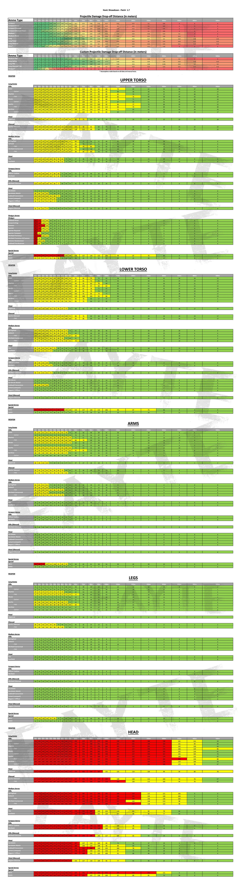

# Handbook
How stuff works, stats and data, lists and tables. 

[Maps](https://hunt-map.info/)
* maps of Lawson Delta, Stillwater Bayou and DeSalle. 
* Includes spawns, compound borders
* Has a distance measuring tool

*Damage Graph*
 (from Discord)

*Damage Drop Off Table*
 ([source](https://www.reddit.com/r/HuntShowdown/comments/s43rei/hunt_showdown_patch_17_updated_damage_dropoff/): [Credit goes to ](https://www.reddit.com/user/iI_FAYTE_Ii/))

*Damage Multipliers*
 (from Discord)

*Custom ammo table*  

**Custom Ammo**
Developer Livestream - Overview (Videos)

[Custom ammo overview](https://youtu.be/UNHUXXlkOjo?t=1349)

**Bullets**

* [Dumdum](https://youtu.be/UNHUXXlkOjo?t=2603)
* [FMJ](https://youtu.be/UNHUXXlkOjo?t=2957)
* [High Velocity](https://youtu.be/UNHUXXlkOjo?t=3320)
* [Poison](https://youtu.be/UNHUXXlkOjo?t=3524)
* [Incendiary](https://youtu.be/UNHUXXlkOjo?t=3909)
* [Spitzer](https://youtu.be/UNHUXXlkOjo?t=4593)
* [Explosive](https://youtu.be/UNHUXXlkOjo?t=4984)

**Shells**

* [Flechette](https://youtu.be/UNHUXXlkOjo?t=5327)
* [Penny Shot](https://youtu.be/UNHUXXlkOjo?t=5628)
* [Slugs](https://youtu.be/UNHUXXlkOjo?t=5922)
* [Starshell](https://youtu.be/UNHUXXlkOjo?t=6505)
* [Dragonbreath](https://youtu.be/UNHUXXlkOjo?t=6705)

**Bolts**

* [Poison](https://youtu.be/UNHUXXlkOjo?t=7026)
* [Explosive](https://youtu.be/UNHUXXlkOjo?t=7116)
* [Shotbolt](https://youtu.be/UNHUXXlkOjo?t=7145)
* [Chaos](https://youtu.be/UNHUXXlkOjo?t=7159)
* [Choke](https://youtu.be/UNHUXXlkOjo?t=7262)
* [All bolt types demonstrated](https://youtu.be/UNHUXXlkOjo?t=7262)

[Inside Hunt's Weapon System with David West](https://www.huntshowdown.com/news/inside-hunt-s-weapon-system-with-david-west)
> bullet speed and damage have changed since this article was written, but basic mechanics remain the same. 

[A detailed Hunter's All-In-One Guide (Article)](https://steamcommunity.com/sharedfiles/filedetails/?id=1443266818)

* An up-to-date written reference for weapons, monsters, and just about everything else
* Contains some (opinionated) pros and cons for each weapon 

[Hunt Wiki](https://huntshowdown.fandom.com/wiki/Hunt:_Showdown_Wiki)

## Matchmaking

[Psychoghost - The NEW 1.5.1 matchmaking! Full Matchmaking guide [Hunt Guide #25]](https://youtu.be/MaDUrJBzQ9g)
* [Existing Matchmaking](https://youtu.be/MaDUrJBzQ9g?t=60)
* [New Matchmaking](https://youtu.be/MaDUrJBzQ9g?t=216)
* [Trainee Mode](https://youtu.be/MaDUrJBzQ9g?t=4644)
* [Group Matchmaking](https://youtu.be/MaDUrJBzQ9g?t=616)
* [Quickplay](https://youtu.be/MaDUrJBzQ9g?t=820)

[Official Blog - Hunt's New Skill-Based Matchmaking System Explained](https://www.huntshowdown.com/news/hunt-s-new-skill-based-matchmaking-system-explained)
> [Update on matchmaking improvements](https://www.huntshowdown.com/news/update-on-matchmaking-improvements)
