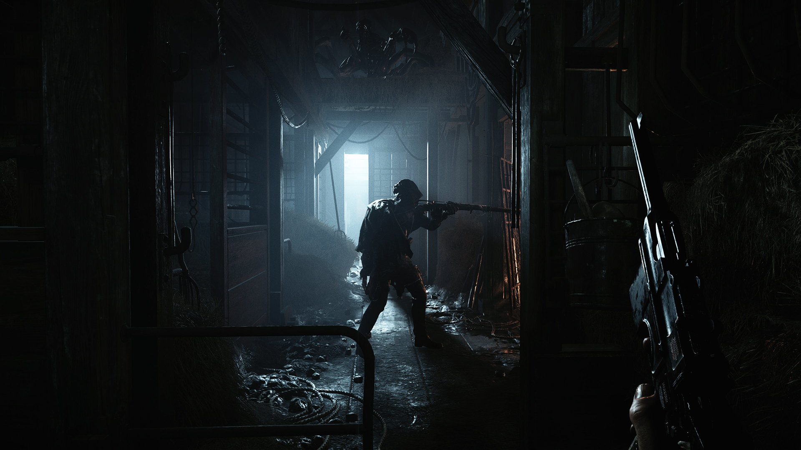

Welcome to...  
 

 

<a href="beginner">

 Beginner's Guides
</a>
 
<a href="guides">

 Guides, Tips, and Tricks
</a>
 
<a href="handbook">
  
   Handbook
</a>

# Links
Official Hunt:Showdown website.  
[www.huntshowdown.com](https://www.huntshowdown.com/)  

Feeback for the game, technical support, looking for players, casual chat, lore discussions and official announcements.  
[Official Discord](https://discord.gg/huntshowdown)

Report bugs, cheating, and misconduct, or get technical support for the game.  
[Support Link](https://huntshowdown.kayako.com/)

The roadmap is currently MIA.   
[Roadmap](https://www.huntshowdown.com/roadmap)

Trailers, teasers, and developer live streams.  
[Official YouTube channel](https://www.youtube.com/c/HuntShowdown)

Live streams.  
[Crytek Twitch channel](https://www.twitch.tv/crytek)

Important information about game mechanics and list of known bugs.  
[Patch Notes (steam)](https://store.steampowered.com/newshub/app/594650?updates=true)

Major patches are released to the test server before going live.  
[Test Server Patch Notes (steam)](https://steamcommunity.com/app/770720/allnews/)

# About
[About](about) this site.  
Changes to the site are listed at [Changelog](change-log) 

